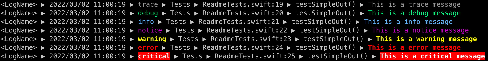
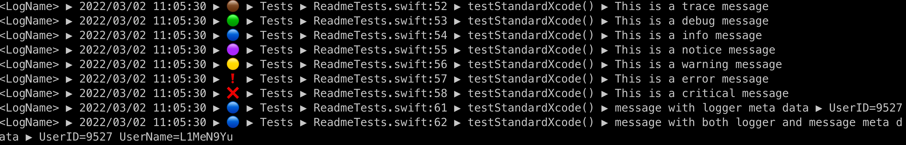

# Senna

**a logging engine backend of Apple's** [swift-log](https://github.com/apple/swift-log)

## Status


[](https://github.com/L1MeN9Yu/Senna/releases)
[](https://github.com/L1MeN9Yu/Senna/actions/workflows/Build.yml)
[](https://codecov.io/gh/L1MeN9Yu/Senna)
[](https://github.com/L1MeN9Yu/Senna/blob/main/LICENSE)

[](https://github.com/L1MeN9Yu/Senna/blob/main/Package.swift)

## Features

* Pure Swift
* Backend of `apple/swift-log`
* Both Darwin(iOS macOS watchOS tcOS) and Linux compatibility
* Builtin output target : `[stdout/stderr,file,oslog,syslog]`
* ANSI escape code
* Complete customizable for text out
* 100% Code Coverage

## Examples

### Use Builtin Sinks

#### Simple stdout

```swift
//create sink
let sink = StandardSink.out()
//create formation
let formation = Formation.standard
//create log
var logger = Logger(label: "LogName") {
    Handler(name: $0, sink: sink, formation: formation, logLevel: .trace)
}
// do some logs
logger.trace("This is a trace message")
logger.debug("This is a debug message")
logger.info("This is a info message")
logger.notice("This is a notice message")
logger.warning("This is a warning message")
logger.error("This is a error message")
logger.critical("This is a critical message")
 ```

Terminal out :



#### Change LogLevel

```swift
logger.logLevel = .info
logger.debug("will not log")
logger.info("will log")
```

#### Add MetaData

```swift
logger[metadataKey: "UserID"] = .stringConvertible(9527)
logger.info("message with logger meta data")
logger.info("message with both logger and message meta data", metadata: ["UserName": .string("L1MeN9Yu")])
```

Terminal out :


### Builtin Sinks

#### FileSink

```swift
let fileSink = FileSink("path/of/log")
```

Log message will write to file.

See [Tests](Tests/FileSinkTests.swift) for more.

#### OSLogSink (Apple platform only)

```swift
let osLogSink = OSLogSink(subsystem: "subsystem", category: "category")
```

Log message will write to OS log (Apple's syslog). Use `Connsole.app` in your macOS to watch oslog messages.

See [Tests](Tests/OSLogSinkTests.swift) for more.

#### SystemLogSink (Linux)

```swift
let systemLogSink = SystemLogSink()
```

Log message will write to syslgo.

See [Tests](Tests/SystemLogSinkTests.swift) for more.

### Formation

`Formation` generate the log message.

There are some builtin `Formation`:

1. Formation.standard. This is default for `stdout/stderr`.
2. Formation.standardXcode. This is default for `stdout/stderr` display in Xcode due Xcode's console is not support ANSI escape code.

3. Formation.file. This is default for `File`.
4. Formation.os. This is default for `OSLog`.
5. Formation.system. This is default for `syslog`.

### Advanced Customize Formation

Create `Formation` is simple : `Formation(components: <#T##[Component]##[Senna.Component]#>, printer: <#T##Printable?##Senna.Printable?#>, separator: <#T##String?##Swift.String?#>)`

The Formation contains `components: [Component]`, `printer: Printable?` and `separator: String?`.

#### Component

Component is your log message's element. See [Component](Sources/Types/Component.swift) file.

#### Printable

The `Printable` enhanced your log messages, It can add color or style to the component.

The builtin `Printer` has two default instance.
`Printer.standard` for `stdout/stderr`.
`Printer.standard` for `stdout/stderr` in Xcode.

You can create new `Printer` instance or Use `YourPrinter` which implements `Printable` protocol.

See [Printer](Sources/Implements/Printer.swift) and [Printable](Sources/Protocols/Printable.swift) for more.

#### Separator

The `Separator` string is used for split log message's component.
The `Formation.standard`'s separator is `" ▶ "`.

## Installation

### Swift Package Manager

Add the following to your `Package.swift` file:

```swift
dependencies: [
    .package(url: "https://github.com/L1MeN9Yu/Senna.git", from: "2.4.0")
]
```

## Credit

* [swift-log](https://github.com/apple/swift-log)
* [swift-log-format-and-pipe](https://github.com/Adorkable/swift-log-format-and-pipe)
* [spdlog](https://github.com/gabime/spdlog)
* [Rainbow](https://github.com/onevcat/Rainbow)

## License

Senna is available under the [MIT license](http://www.opensource.org/licenses/mit-license). See the LICENSE file for details.

## Thanks | 鸣谢

Thanks to [JetBrains][JetBrains] for "Licenses for Open Source Development". [JetBrains][JetBrains] supports non-commercial open source projects by providing core project contributors with a set of best-in-class
developer tools free of charge.

感谢 [JetBrains][JetBrains] 提供的开源开发许可证。[JetBrains][JetBrains] 通过为项目核心开发者免费提供开发工具来支持非商业开源项目。

[JetBrains]: https://www.jetbrains.com/?from=Senna
